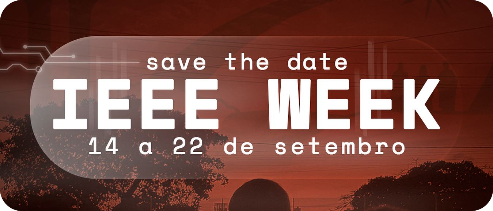

<h1 align = "center">
    
    Workshop: Introdução ao Flutter
</h1>

    
    

  <a href = "#sobre-ieee-week">🧑‍💻📆 Sobre IEEE Week</a> &nbsp;&nbsp;&nbsp;|&nbsp;&nbsp;&nbsp;
  <a href = "#sobre-workshop">🧑‍🏫💻 Sobre o Workshop</a> &nbsp;&nbsp;&nbsp;|&nbsp;&nbsp;&nbsp;
  <a href = "#material">📑 Material disponibilizado</a> 

 
 ***

<h2 id = "sobre-ieee-week">🧑‍💻📆 Sobre IEEE Week</h2>

Trata-se de um evento realizado na [Universidade Federal do Rio Grande do Norte](https://www.ufrn.br/) (campus Natal) durante os dias 14, 15, 21 e 22 de setembro de 2023, com a finalidade de reunir alunos, professores e profissionais no que tange às três esferas principais do evento, envolvendo tecnologia, empreendedorismo e seus impactos sociais, por meio de atividades voltadas à participação do público como palestras, minicursos e workshop.

    <a href="https://www.instagram.com/p/CwGcY_3u125/?utm_source=ig_web_copy_link&igshid=MzRlODBiNWFlZA==">Publicação no Instagram 📷</a>

***

<h2 id = "sobre-workshop">🧑‍🏫💻 Sobre o Workshop</h2>

O workshop de introdução ao Flutter, ministrado no dia 14 de setembro de 2023, durante a IEEE WEEK do IEEE Ramo Estudantil UFRN, traz uma jornada que apresenta o
desenvolvimento de aplicações móveis com foco em iniciantes no mundo da
programação, tendo como pauta o mundo mobile e a participação do Flutter no mercado de desenvolvimento.

|                 | Informações                         |
|-----------------|-------------------------------------|
| **Palestrante:**| Gabriel Cavalcante e Manoel Freitas |
| **Local:**      | CIVT (UFRN/IMD)                     |

### Descrição dos palestrantes 

**🧑‍🏫 [Gabriel Cavalcante:](https://www.instagram.com/gabriel_cavd/)**
Bacharelando em Tecnologia da Informação pela Universidade Federal do Rio Grande do
Norte, Membro do ramo IEEE UFRN, Voluntário do capítulo Computer Society do IEEE e desenvolver mobile.

**🧑‍🏫 [Manoel Freitas:](https://github.com/JosManoel)**
Desenvolvedor mobile Flutter, Técnico em Edificações (IFRN - SPP), Técnico em
Eletrônica (UFRN/IMD), voluntário do capítulo Computer Society do IEEE e cursando atualmente Bacharelado em TI (UFRN/IMD).

***

<h2 id = "material">📑 Material disponibilizado</h2>

* [📖 Slides da apresentação](https://www.canva.com/design/DAFgSSjbp8k/HuJLU5xKwpnYsokD9UDHtQ/view?utm_content=DAFgSSjbp8k&utm_campaign=designshare&utm_medium=link&utm_source=publishsharelink)
* [📜 🐦 Documentação Flutter](https://docs.flutter.dev/)
* [📜 🎯 Documentação Dart](https://docs.flutter.dev/)

***

  👋 Feito com muito ☕ , 🎧, 💻 e mais um pouco de ☕.

